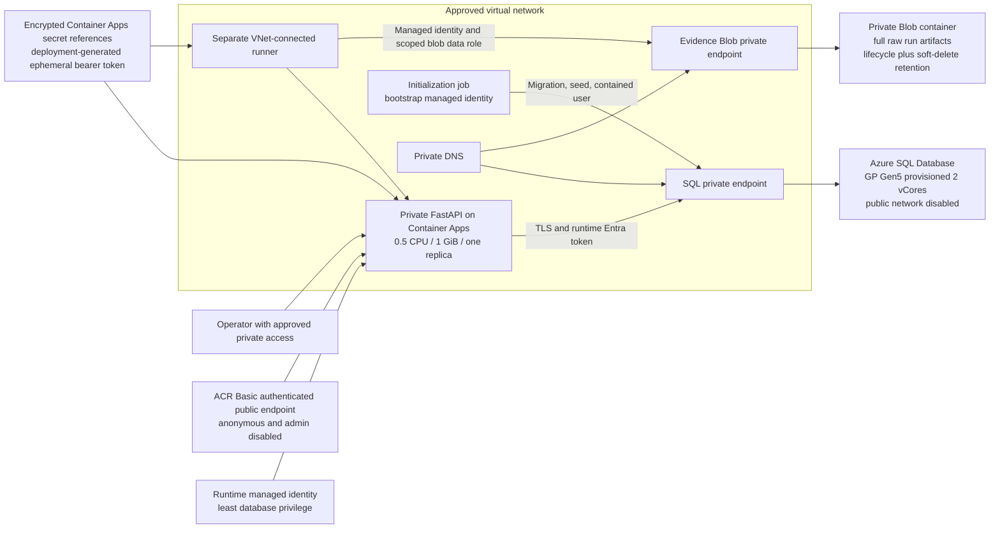
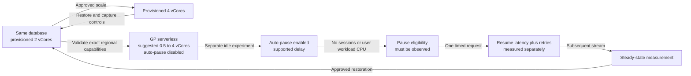
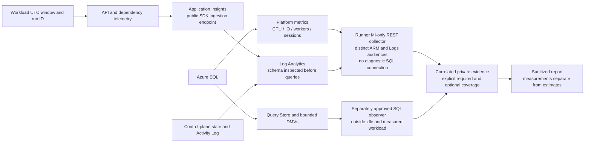
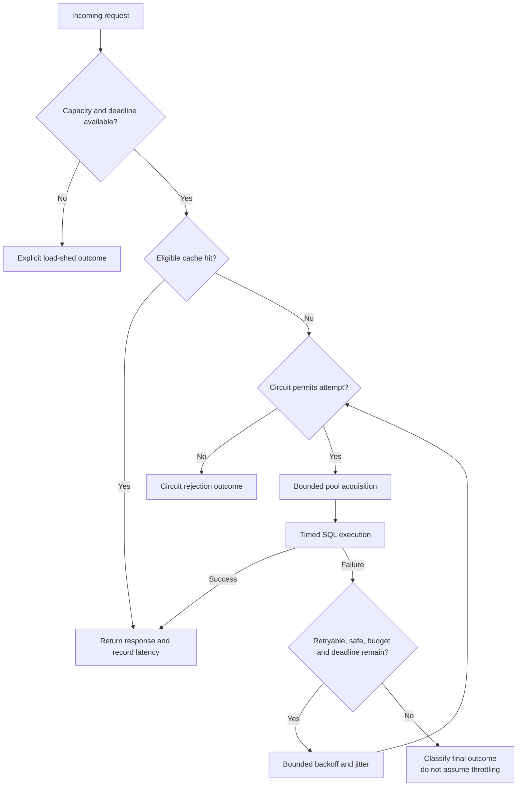
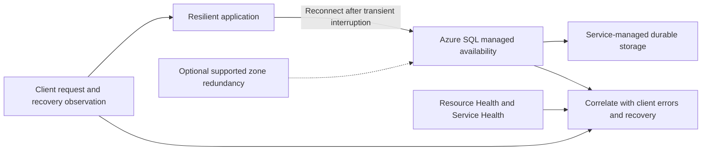
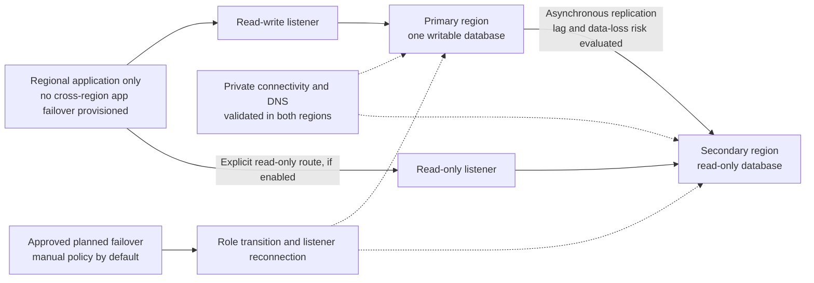
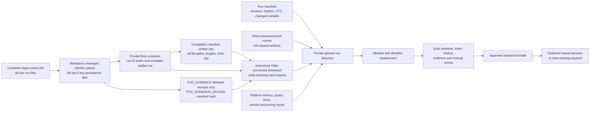
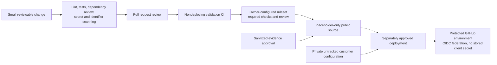

# Architecture diagrams

These are design diagrams, not screenshots or evidence of a live deployment.
All starting settings are a **POC assumption, not a confirmed customer
requirement.** Measured behavior: **Not demonstrated by this POC run.**

## 1. Provisioned baseline

## 2. Serverless comparison

Pause is not guaranteed; feature exclusions and background connections matter.
Configured maximum vCores remain a ceiling.

## 3. Monitoring flow

## 4. Spike handling

## 5. In-region availability

This is a conceptual service view, not a claim about an exposed replica count or
a customer SLA. Built-in availability is not cross-region DR.

## 6. Cross-region failover group

Readable secondary and active/active application hosting do not mean multi-primary
writes. Forced failover may lose data and requires separate explicit approval.

## 7. Evidence collection

## 8. Public-repository controls

Rulesets, environment approvals, federation, and scanning features must be
configured by repository owners; files in Git do not enable them automatically.
